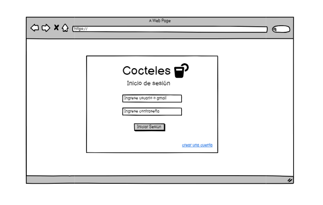

# Historia de Usuario: Ingreso
Yo como: Usuario de la aplicación
Quiero: Poder iniciar sesión en la aplicación 
Para: Acceder a mis funciones y datos personales.

## Pendientes de definición:
- ¿Qué información de inicio de sesión se requerirá (por ejemplo, correo electrónico y contraseña, nombre de usuario y contraseña, etc.)?
- ¿Cómo se gestionarán los errores de inicio de sesión (por ejemplo, contraseña incorrecta, usuario no registrado, etc.)?
- ¿Se implementará la funcionalidad de recordar sesión para mantener al usuario conectado?

## Especificación de requerimientos:
La aplicación debe proporcionar una pantalla de inicio de sesión donde los usuarios puedan ingresar sus credenciales.
- Debe haber validaciones para verificar la autenticidad del usuario y manejo de errores en caso de credenciales incorrectas.
- Puede implementarse una opción de "recordar sesión" para mantener al usuario conectado.

## Análisis: 
### Pantalla de Ingreso
La pantalla de ingreso debe permitir al usuario realizar las siguientes acciones:


Ingresar las credenciales (por ejemplo, correo electrónico y contraseña).

## Criterios de aceptación (Gherkin): 
### Inicio de Sesión
Dado: Que el usuario ha abierto la aplicación.
Cuando: El usuario ingresa las credenciales y hace clic en el botón "Iniciar Sesión".
Entonces: El sistema debe validar las credenciales y permitir el acceso si son correctas.

## Diseño: 
### Pantalla de Ingreso
La pantalla de ingreso debe incluir los campos para el correo electrónico o nombre de usuario y la contraseña, además de un botón "Iniciar Sesión".

Request:

```
POST BASE_URL api/v1/login/
Accept: Application/json
Authorization: Bearer JWT
```
Request:
```
{

}
```

Response: Exitoso statusCode: 200
```
{
 message: “Solicitud realizada de manera exitosa”
}
```
Response: No encontrado statusCode: 404

