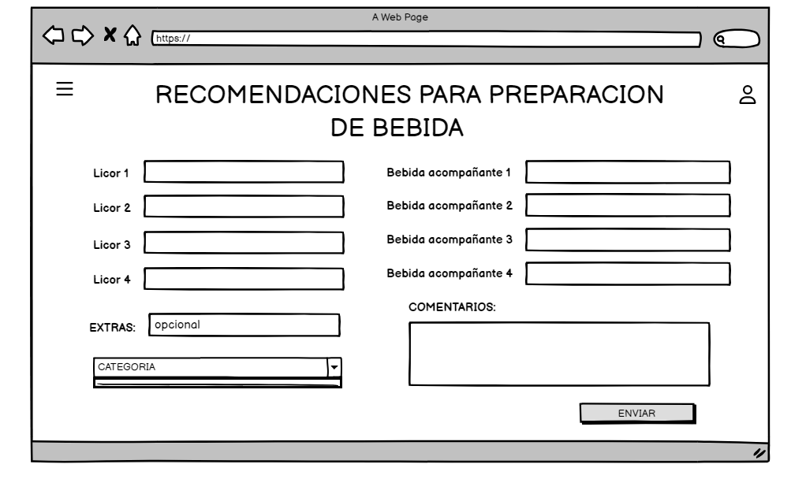

# Historia de Usuario: Generar Cócteles Personalizados

Yo como: Usuario de la aplicación 
Quiero: Poder generar cócteles personalizados utilizando los ingredientes disponibles en mi hogar y complementarlos con información adicional de las APIs de consumo.
Para: para elaborar un cóctel con mis ingredientes favoritos o disponibles

## Pendientes de definición
- ¿Cuáles serán los ingredientes disponibles en el hogar del usuario?
- ¿Qué tipo de ventajas ofrecerá la suscripción?

## Especificación de requerimientos
- La aplicación debe permitir al usuario ingresar ingredientes disponibles en su hogar.
- La capacidad máxima de licores ingresados será 4.
- La capacidad máxima de mezclador o combinador de licores ingresados será de 4.
- El espacio de extras será opcional.
- Debe haber una integración con APIs de consumo para obtener información adicional sobre ingredientes y cócteles.
- Los cócteles generados deben basarse en los ingredientes ingresados por el usuario.
- Debe haber opciones de personalización, como seleccionar el tipo de cóctel (por ejemplo, refrescante, fuerte, dulce, etc.).

## Análisis: 
### Pantalla de Generación de Cócteles Personalizados
La pantalla de generación de cócteles personalizados debe permitir al usuario realizar las siguientes acciones:

- Ingresar ingredientes disponibles en su hogar.
- Personalizar las preferencias de cócteles, como el tipo de cóctel deseado.


### Pantalla de recomendación de cócteles generados
La pantalla de recomendación de cócteles generados muestra al usuario todos los cócteles que puede preparar basados en los ingredientes y preferencias ingresados.


## Criterios de aceptación
Gherkin

## Generación de Cócteles

Dado: Que el usuario ha iniciado sesión en la aplicación.
Cuando: El usuario ingresa ingredientes disponibles y personalizar sus preferencias de cócteles.
Entonces: La aplicación debe generar recomendaciones de cócteles basados en los ingredientes y preferencias del usuario.


## Validación de licores y combinaciones ingresados
Dado: Que el usuario ha iniciado sesión en la aplicación
Cuando: El usuario ingresa los licores disponibles y las combinaciones o mezclas deseadas.
Entonces: La aplicación debe verificar que sean máximo 4.
 
## Diseño: 
### Pantalla de Generación de Cócteles Personalizados
Para realizar la solicitud de generación:

Request:
```
POST BASE_URL/api/v1/coctelia
Accept: Application/json
Authorization: Bearer JWT
```
Response: Exitoso statusCode: 200
```
{

}
```
Response: No encontrado statusCode: 404

## Pantalla de recomendación de cócteles generados
Para obtener los cócteles recomendados en base a los ingredientes.

Request:
```
[
    {
        "nombre": "Margarita",
        "descripcion": "Un cóctel clásico y refrescante con sabor a limón.",
        "etiquetas": ["cítrico", "clásico", "veraniego"],
        "ingredientes": [
            "Tequila",
            "Triple sec",
            "Jugo de limón fresco",
            "Azúcar",
            "Hielo"
        ],
        "preparacion": "1. En un agitador, combine el tequila, el triple sec, el jugo de limón y el azúcar. Agite bien.\n2. Sirva en un vaso de margarita previamente enfriado con sal en el borde.\n3. Agregue hielo y decore con una rodaja de limón.",
        "notas": []
    },
    {
        "nombre": "Piña Colada",
        "descripcion": "Un cóctel tropical y cremoso con sabor a piña y coco.",
        "etiquetas": ["tropical", "cremoso", "verano"],
        "ingredientes": [
            "Ron blanco",
            "Crema de coco",
            "Jugo de piña",
            "Hielo"
        ],
        "preparacion": "1. En una licuadora, combine el ron blanco, la crema de coco, el jugo de piña y el hielo.\n2. Mezcle hasta que la mezcla esté suave y cremosa.\n3. Sirva en un vaso de piña o en un vaso alto y decore con una rodaja de piña y una cereza maraschino.",
        "notas": []
    },
    {
        "nombre": "Mojito",
        "descripcion": "Un cóctel refrescante a base de menta y lima.",
        "etiquetas": ["refrescante", "hierbabuena", "verde"],
        "ingredientes": [
            "Ron blanco",
            "Menta fresca",
            "Azúcar",
            "Jugo de lima",
            "Agua con gas",
            "Hielo"
        ],
        "preparacion": "1. En un vaso, mezcle las hojas de menta y el azúcar.\n2. Agregue el jugo de lima y mezcle bien.\n3. Añada el ron blanco y el hielo.\n4. Termine con el agua con gas y decore con una ramita de menta y una rodaja de lima.",
        "notas": []
    }
]
```

Response: No encontrado statusCode: 404

