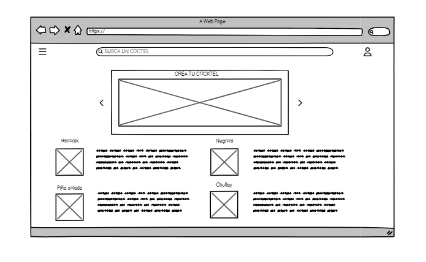

# Historia de Usuario: Listar Recetas de Cócteles de Forma Pública

Yo como: Usuario de la aplicación
Quiero: Ver recomendaciones aleatorias de recetas de cócteles de forma pública en la pantalla de inicio.
Para: Descubrir nuevas recetas de cócteles y encontrar inspiración para preparar bebidas.

## Pendientes de definición:

- ¿Cómo se determinará cuáles son las recetas públicas que se mostrarán como recomendaciones?
- ¿Qué información adicional se mostrará junto con cada receta en la pantalla de inicio?

## Especificación de requerimientos:
- La pantalla de inicio de la aplicación mostrará recomendaciones aleatorias de recetas de cócteles de forma pública.
- Cada receta recomendada debe mostrar al menos los siguientes campos: nombre del cóctel, categoría, ingredientes y una imagen.
- Los usuarios pueden hacer clic en una receta recomendada para ver más detalles y las instrucciones de preparación.
- Las recomendaciones deben actualizarse automáticamente cada vez que el usuario visite la pantalla de inicio.

## Análisis:

### Pantalla de Inicio con Recomendaciones de Cócteles
La pantalla de inicio debe permitir al usuario:
- Ver una lista de recetas de cócteles recomendadas de forma aleatoria y pública.
- Hacer clic en una receta recomendada para ver detalles adicionales, incluyendo instrucciones de preparación.
- Actualizar la lista de recomendaciones con solo un gesto o al recargar la pantalla.


## Criterios de Aceptación:
Gherkin

## Listado de Recetas de Cócteles
Dado: Que soy un usuario registrado en la aplicación.
Cuando: Accedo a la pantalla de inicio.
Entonces: Debo ver una lista de recetas de cócteles recomendadas de forma pública, cada una con un nombre, categoría, ingredientes y una imagen.

## Exploración Detallada de Receta de Cóctel
Dado: Que soy un usuario registrado en la aplicación.
Cuando: Hago clic en una de las recetas recomendadas.
Entonces: Debo poder ver detalles adicionales de la receta, incluyendo las instrucciones de preparación.

## Diseño:
### Pantalla de Inicio con Recomendaciones de Cócteles

La pantalla de inicio mostrará una lista de recetas de cócteles recomendadas de forma pública, cada una con un diseño que incluye el nombre del cóctel, la categoría, la imagen y un botón para ver más detalles. Las recomendaciones se actualizarán automáticamente cada vez que se acceda a la pantalla.


Request:
```
GET www.thecocktaildb.com/api/json/v1/1/random.php
```
Response: Exitoso statusCode: 200
```
{
"drinks": [
{
"strDrink": "Nombre del Cóctel",
"strCategory": "Categoría del Cóctel",
"strDrinkThumb": "URL de la imagen",
"idDrink": "ID de la Receta"
},
// Otras recetas recomendadas...
]
}
```

Response: No encontrado statusCode: 404


