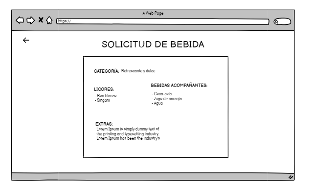

# Historia de Usuario: Crear Recetas Nuevas de Cócteles

Yo como: Usuario de la aplicación
Quiero: Poder crear nuevas recetas de cócteles personalizadas
Para: Compartir con el público en general

## Pendientes de definición:
- ¿Cómo se validará la originalidad y la calidad de las recetas creadas por los usuarios?

## Especificación de requerimientos:
- La aplicación debe permitir a los usuarios crear nuevas recetas de cócteles.
- Cada receta debe incluir al menos los siguientes campos: nombre, ingredientes, preparación, categoría.
- Los usuarios deben tener la opción de cargar una imagen de su cóctel.
- Las recetas deben ser clasificadas en categorías (por ejemplo, refrescantes, clásicos, tropicales).


## Análisis:
### Pantalla de Creación de Recetas de Cócteles
La pantalla de creación de recetas debe permitir al usuario realizar las siguientes acciones:
- Ingresar el nombre del cóctel.
- Seleccionar la categoría de la receta (por ejemplo, refrescante, clásico, tropical).
- Agregar los ingredientes y las cantidades necesarias.
- Describir el proceso de preparación.
- Cargar una imagen opcional del cóctel.




## Criterios de Aceptación:
Gherkin

## Creación de Recetas de Cócteles
Dado: Que soy un usuario registrado en la aplicación.
Cuando: Accedo a la función de crear una nueva receta de cóctel.
Entonces: Debo poder ingresar el nombre, la categoría, los ingredientes, la preparación y la imagen opcional de la receta.

## Diseño:
### Pantalla de Creación de Recetas de Cócteles
Para realizar la creación de una receta:

Request:
```
POST BASE_URL/api/v1/cocktailRecipes
Content-Type: application/json
Authorization: Bearer JWT
```
Body:
```
{
   "nombre": "Nombre de la Receta",
    "categoria": "Categoría del Cóctel",
    "ingredientes": "Ingredientes mas la cantidad para la preparacion del coctel...",
    "preparacion": "Pasos para preparar el cóctel...",
    "imagen": "URL de la imagen (opcional)",
    "notas": "Notas adicionales o consejos"
}
```
Response: Exitoso statusCode: 200
```
{
    "message": "Coctel creado con exito"
}
```
Response: No encontrado statusCode: 404
