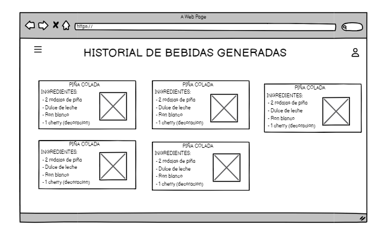
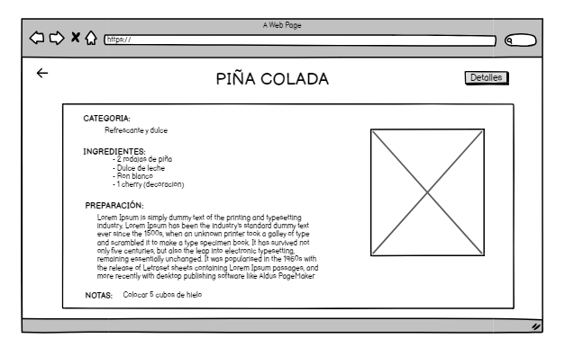

# Historia de Usuario: Ver Historial de Solicitudes a la IA

Yo como: Usuario de la aplicación
Quiero: Poder revisar un historial de las solicitudes que he enviado a la IA y las respuestas que he recibido.
Para: Tener un registro de las recetas sugeridas por la IA basadas en mis preferencias.

## Pendientes de definición

## Especificación de requerimientos:
- La aplicación debe llevar un registro (historial) de las solicitudes enviadas a la IA y las respuestas recibidas.
- Debe haber una interfaz de usuario que permita al usuario acceder y revisar este historial.

## Análisis:
### Pantalla de Historial de Solicitudes a la IA
La pantalla de historial de solicitudes a la IA debe permitir a los usuarios realizar las siguientes acciones:

- Ver una lista de solicitudes en orden cronológico inverso.
- Para cada solicitud, mostrar detalles de los parámetros proporcionados.
- Para cada solicitud, mostrar detalles de la respuesta de la IA, que incluirá la receta sugerida.



### Pantalla de Bebida Generada
La pantalla de bebida generada muestra los detalles de la respuesta de la IA, que incluirá la receta sugerida.



### Pantalla de Detalles de la Solicitud
La pantalla de detalles de la solicitudes a la IA debe permitir observas cuales fueron detalles de los parámetros proporcionados para la generación de la receta.


## Criterios de aceptación:
Gherkin

## Visualización del Historial de Solicitudes a la IA
Dado: Que el usuario ha iniciado sesión en la aplicación.
Cuando: El usuario accede a la sección de historial de solicitudes a la IA.
Entonces: El sistema debe mostrar un historial de solicitudes enviadas a la IA, con detalles de los parámetros proporcionados y los resultados de las respuestas.

## Diseño:
### Pantalla de Historial de Solicitudes a la IA
Esta pantalla podría incluir muestra una lista de solicitudes en orden cronológico inverso.

Request para Obtener Historial de Solicitudes a la IA:
```
GET BASE_URL/api/v1/iaRequestsHistory
Content-Type: application/json
Authorization: Bearer JWT
```
Response Exitoso:
```
[
    {
        "requestId": "123",
        "parameters": {
            "liquors": ["gin", "vodka"],
            "mixers": ["tonic", "soda"],
            "extras": ["mint leaves", "simple syrup"],
            "category": "Cocktail",
            "comment": "Refreshing and minty"
        },
        "response": {
            "cocktailName": "Minty Breeze",
            "description": "A refreshing cocktail with a hint of mint.",
            "category": "Cocktail",
            "ingredients": ["gin", "vodka", "tonic", "soda", "mint leaves", "simple syrup"],
            "preparation": "..."
        },
    },
    // más eventos...
]
```
Response No Encontrado:
```
{
    "message": "No se encontraron solicitudes en el historial."
}
```

### Pantalla de Bebida Generada
Esta pantalla muestra los detalles de la respuesta de la IA, incluyendo la receta sugerida.
Request:
```
GET BASE_URL/api/v1/iaRequestsHistory/{id}
Content-Type: application/json
Authorization: Bearer JWT
```
Response Exitoso:
```
    {
        "requestId": "123",
        "response": {
            "cocktailName": "Minty Breeze",
            "description": "A refreshing cocktail with a hint of mint.",
            "category": "Cocktail",
            "ingredients": ["gin", "vodka", "tonic", "soda", "mint leaves", "simple syrup"],
            "preparation": "..."
        },
    }
```
Response No Encontrado:
```
{
    "message": "No se encontraron la bebida generada en el historial."
}
```


### Pantalla de Detalles de la Solicitud
Esta pantalla muestra los detalles de cada solicitud, incluyendo parámetros proporcionados.

Request:
```
GET BASE_URL/api/v1/iaRequestsHistory/{id}/detail
Content-Type: application/json
Authorization: Bearer JWT
```
Response Exitoso:
```
    {
        "requestId": "123",
        "parameters": {
            "liquors": ["gin", "vodka"],
            "mixers": ["tonic", "soda"],
            "extras": ["mint leaves", "simple syrup"],
            "category": "Cocktail",
            "comment": "Refreshing and minty"
        }
    }
```
Response No Encontrado:
```
{
    "message": "No se encontraron solicitudes en el historial."
}
```